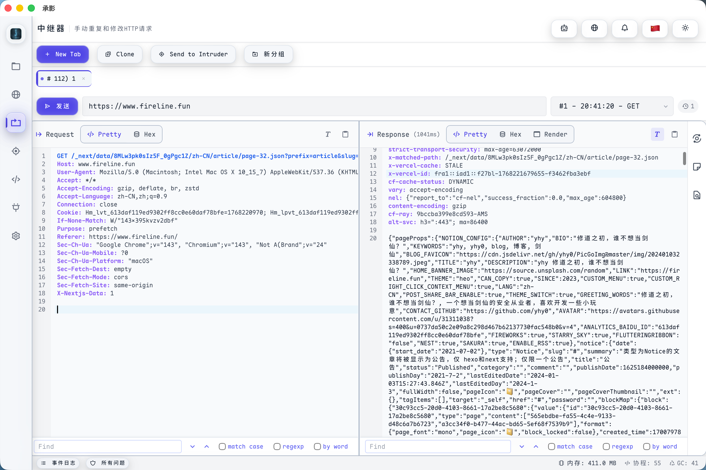

# 承影（ChYing）：三年磨一剑，一个安全人的开源梦

> 写在前面
>
> 2023 年 4 月，我在 GitHub 上创建了一个叫 "承影" 的项目。
>
> 承影，取自古代名剑，《列子·汤问篇》中记载："二曰承影，将旦昧爽之交，日夕昏明之际，北面而察之，淡淡焉若有物存，莫识其状。其所触也，窃窃然有声，经物而物不疾也" 意为在光影交错之际才能隐约看见的神剑。
>
> 我希望这个工具也能如此——在渗透测试的明暗之间，成为安全人手中的利器。

## 缘起：一个安全人的产品梦

我是一个网络安全爱好者，热衷于开发实用、有趣的小工具。

一直以来，我有一个梦想：打造一款像 Xray、BurpSuite 这样被广泛使用的安全产品。

在承影之前，我还做过另一个开源项目——[Jie](https://github.com/yhy0/Jie)，一个综合性的 Web 安全评估工具，支持主被动扫描、漏洞检测、信息收集等功能，目前收获了 600+ Star。

但 Jie 更偏向自动化扫描，是"跑起来就不用管"的那种工具。我还缺一个交互式的渗透测试平台——能抓包、能改包、能重放、能爆破，像 Burp Suite 那样，但更轻量、更现代、更"我的"。

于是，承影诞生了。

而且，我把 Jie 的扫描能力也集成了进来。承影 + Jie，一个负责交互，一个负责自动化，互为补充。

## 三年：断断续续的深夜

从 2023 年到现在，这个项目经历了太多：

第一版（2023）：用 Wails + Vue 搭了个架子，实现了基础的代理、目录扫描、JWT 解析。界面很简陋，但能用。开源后收获了 400+ Star，说实话有点意外。

沉寂期（2023-2024）：工作忙了，项目停更。但心里一直惦记着，总觉得还差点什么。

重构期（2024-2025）：创建了私有仓库，137 次提交，无数个熬夜的深夜，大刀阔斧地重构。

这里要说一个转折点：LLM 的出现。

说实话，我的前端水平很有限，也没有时间系统学习。之前的界面之所以简陋，就是因为我只能写出那种程度的代码。

但 Cursor 等 AI 编程工具出来后，一切都变了。我不再需要纠结"这个动画效果怎么实现"、"这个布局用 flex 还是 grid"——我只需要描述我想要什么，AI 帮我实现。

AI 是个人能力的放大器。 它不会替你思考产品该怎么设计，但它能帮你把想法变成代码。对于我这种"有想法但技术有短板"的人来说，这简直是破局的关键。

于是，那个在我脑海里构思了很久的"现代化 UI"，终于能够落地了。

现在：它长这样了

核心功能

HTTP 代理 & 流量分析
- 实时捕获 HTTP/HTTPS 流量
- 智能过滤（按方法、主机、状态码、路径）
- 右键菜单一键发送到 Repeater/Intruder/扫描器

Repeater（重放器）
- 手动修改请求，反复测试
- 支持多标签页，对比测试更方便

Intruder（入侵者）
- 自动化攻击测试
- 支持多种 Payload 类型
- 结果实时展示

Decoder（编解码）
- URL/Base64/Hex/Unicode 一键转换
- MD5/SHA 哈希计算
- 支持链式编解码

插件模块
- JWT 解析与密钥爆破
- Swagger API 测试（未授权访问、注入检测）
- 403 Bypass
- Shiro 解密

集成 Jie 扫描器
- 被动流量扫描
- 主动漏洞检测（XSS、SQL 注入、SSRF、命令执行等）
- Nuclei POC 支持

技术栈

- 后端：Go（高性能、跨平台）
- 前端：Vue 3 + TypeScript
- 框架：Wails v3（Go + Web 的完美结合）
- 数据库：SQLite（轻量本地存储）
- 扫描引擎：Jie

UI：液态玻璃设计

这次重构最大的变化是 UI。借助 AI 的帮助，我终于实现了心中的设计：

- 液态玻璃风格（Glassmorphism）：半透明、模糊背景、柔和阴影
- 深色/浅色主题：护眼，也好看
- 响应式布局：各种分辨率都能用
- 流畅动画：每个交互都有反馈

我不是专业设计师，但我希望每天打开这个工具时，心情是愉悦的。

## 为什么现在开源？

这个项目在我的私有仓库里躺了快两年。

一直没开源，总觉得"还不够好"——功能没完善、Bug 没修完、UI 还能更好……再加上工作重心转移，渗透测试做得少了，Burp 也很久没打开。

但最近想通了：完美是开源的敌人。

与其让它继续躺在硬盘里，不如放出来。也许有人会觉得它有用，也许有人会帮忙改进，也许它能激发别人做类似的事情。

更重要的是，我想给这三年的付出留下一点痕迹。代码会过时，技术会迭代，但这份"想做点什么"的心意，希望能被记住。

写给同行

如果你也是安全从业者，我想说：

这个工具不是要取代 Burp Suite。Burp 依然是最专业、最全面的渗透测试工具。

但如果你：
- 想要一个启动更快的轻量级工具
- 想要一个界面更现代的选择
- 想要一个可以自己改的开源方案
- 或者只是想看看一个安全人是怎么折腾自己的工具的

那么，承影也许值得你试试。

最后

三年，137 次提交，无数个深夜。

从一个简陋的原型，到现在这个样子。

它不完美，还有很多要改进的地方。但它是我的，是我一行一行敲出来的。

现在，它也可以是你的了。

---
承影 GitHub: https://github.com/yhy0/ChYing

Jie GitHub: https://github.com/yhy0/Jie

Star 一下？ 这是对一个独立开发者最好的鼓励。

---
承影，愿你在光影之间，找到属于自己的锋芒。

---